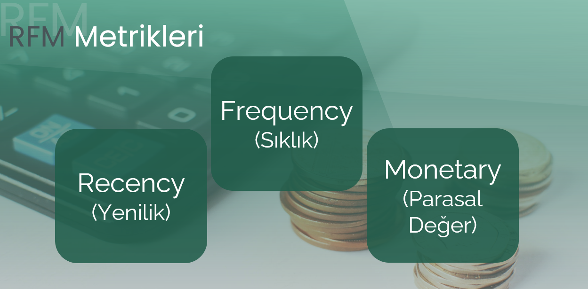
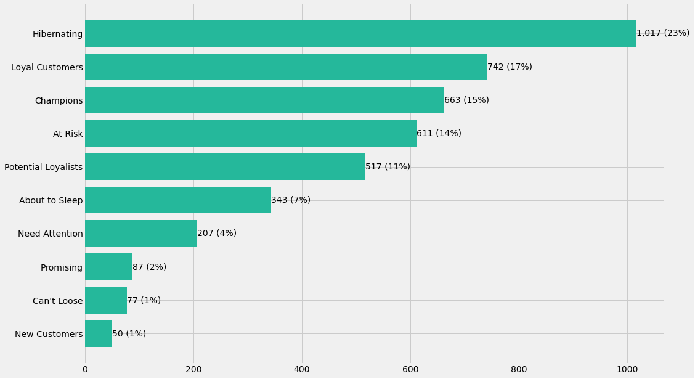

# RFM Analizi ile Müşteri Segmentasyonu

Dünya nüfusunun %20’si toplam zenginliğin %80ini oluşturuyor.

Şirketlerin sattığı ürünlerin %20’si toplam kârlılığın %80’ini oluşturuyor.

**Sizin bir şirketiniz yok mu ?** 

%80 ihtimalle, siz de dolabınızdaki kıyafetlerinizin %20sini giyiyor veya arkadaşlarınızın sadece %20si ile buluşuyorsunuz.

**Vilfredo Pareto** İtalya topraklarının %80’inin nüfusun %20 sine ait olduğunu farketmiş ve ortaya böyle bir **80/20 Kuralı - Pareto İlkesi** çıkmış.

Kuralın anlatmak istediği şey : **Sonuçların %80’ini eylemlerin %20si oluşturur**.

E-ticarette 80/20 kuralı, işletmenizin kârının % 80'inin - müşterilerinizin yaklaşık% 20'sinden geldiği anlamına gelir.

Peki garip bir şekilde gözlemlenen bu kurala göre, kârınızı arttırabilecek o değerli %20 müşterinizi nasıl bulacaksınız ?  

**Şayet bulabildiniz, onlara ne demek isterdiniz?**

# RFM Segmentasyonu

RFM Analizi müşteri davranışlarını segmentlere ayırmak için kullanılan bir tekniktir. RFM bir veri bilimi analitiği uygulamasıdır.

Makine öğrenmesi modeli değil kural tabanlı bir yöntemdir.

Müşterilerin satın alma alışkanlıkları üzerinden pazarlama ve satış stratejileri belirlemeye yardımcı olur.

RFM ölçümlerini derinlemesine incelemek, işletmelerin üç önemli soruyu yanıtlamasına yardımcı olabilir: 

- Bir müşteri ne kadar yakın zamanda satın aldı? 
- Müşteri ne sıklıkla satın alıyor? 
- Ne kadar harcıyorlar?

### Neden RFM?

Elimizde birçok metrik  varken; örneğin makine öğrenmesi yöntemiyle Un-supervised (Gözetimsiz Öğrenme) ile bir clustering (kümeleme) yaptığımızda değişkenlerin standartlaştırılması, aykırılıkların incelenmesi gibi bir takım ön işleme işlemlerinden geçirilmesi gerekmekte ve sonucunda ise hangi kümenin nasıl bir düzeyde neyi temsil ettiğinin net şekilde kavranması konusunda zorluklar yaşayabiliyoruz. 

Bu tarz unsupervised makine öğrenmesi yöntemlerinin avantajları daha fazla faktörü gruplamada ortaya çıkarken, az değişken ile çalışabileceğimiz bir analizde kural tabanlı yöntemlerden olan RFM analizi bize daha karakteristik sonuçlar verebiliyor.

RFM analizinde sadece satın alma, müşterinin sıcaklığı ve bırakılan paraya bakılıp, çok fazla detaya inilmiyor bu sebeple RFM analizi hala pazarlama dünyasında en sık kullanılan tekniklerden birisidir.

RFM analizinin ileri seviyesinde;

- Yapılma sıklığı, 

- Hangi müşterilere yapılacağı,

- Alınan aksiyonlara göre müşterilere nasıl davranılacağı gibi sorulara cevap aranır.

RFM’in daha az metrikten güzel sonuçlara gidebiliyor olması, unsupervised makine öğrenmesi yöntemlerine göre  RFM’i daha güzel kılıyor.

### RFM Metrikleri:

**Recency:**

Yenilik anlamına gelip müşterinin en son ne zaman alışveriş yaptığı bilgisidir.

**Frequency:**

Sıklığı göstermektedir. Müşterinin ne kadar sıklıkta bizden alışveriş yaptığı bilgisi.

**Monetary:**

Parasal Değer. Müşterinin bizim için toplam harcadığı parayı gösterir.

Tüm bu değişkenlerin değerleri ile müşterilerimizi gruplara ayırmamız ve grupların karakteristik özelliklerini belirlememiz mümkün. Gelin bu işlemin adımlarını beraber işleyelim.

Örnek RFM tablosu başlangıçta bu şekilde oluyor.

**Recency Hesaplama**

Recency (R) değişkenini elimizdeki tarih değişkeninden oluşturuyoruz. Yaptığımız işlem belirtilen son alışveriş gününden her bir müşterinin son alışveriş tarihini çıkartmak oluyor. 

Burada **Recency** skoru için büyüklük ve küçüklük algısı farklıdır.

Yani Recency için 1 olan değer (en son 1 gün önce alışveriş yapmış) bizim için en iyi değer,  80 olan ise 1’e göre daha kötü olan bir değerdir.

**Frequency Hesaplama** 

Frequency (F) her bir müşterinin toplamda yapmış olduğu alışveriş sayılarından oluşuyor. Burada dikkat edilmesi gereken nokta her bir eşsiz fatura numarası çoklanmış olabilir ve bizim bunu tekil olarak saydırmamız gerekiyor.  

Buradaki yüksek değerler bizim için güzel değerler oluyor ve skorlamamızı buna göre yapıyoruz.

**Monetary Hesaplama** 

Monetary (M) kısmında ise müşterinin bu zaman diliminde bize kazandırdığı parayı hesaplıyoruz. Örnek verisetimizde direk olarak alabileceğimiz böyle bir değişken yoktu ve ürünlerin adetleri ile birim fiyatlarını çarparak her bir alışverişe ait toplam tutarı hesapladık. O yüzden kod notebookumuzda çok güzel ve öğretici aşamalar bizi bekliyor.

Sonrasında;

Aldığımız bu üç skorları puanlanabilir kılmak için skorlara dönüştürüyoruz.

**Neden elimizdeki sayısal değerleri skorlara çevirmeliyiz ?**

Metrikler bazında değişkenlerdeki değerlerin hangisinin küçük, hangisinin büyük olduğunu bilemiyoruz ? Örneğin monetary değişkeninde 3000 değerini görüp büyük diyebiliyoruz fakat 3000’den büyük değerler de olabilir.

Dolayısıyla RFM metriklerinde büyüklük küçüklük algısını oturtabilmek için bütün gözlem birimlerine bakmamız gerekiyor. Tek bir müşteriye odaklandığımızda elimizdeki değerleri bir yere oturtamıyoruz bundan dolayı skor oluşturmak zorundayız.

Skorlama işleminden sonra hangisinin büyük hangisinin daha küçük olduğunu daha net bir şekilde görebiliyoruz.

Skor tablosunda dikkat edilmesi gereken durum Recency değişkeninde artık küçük olan değeri büyük olarak algılamıyoruz, çünkü burada bu büyüklük küçüklük algısına göre bir skorlama entegre ettik ve kodlarımızda da bu işlemi yapacağız.

## RFM SKORU

Son basamakta yapacağımız işlem bu metrikler üzerinden RFM skoru oluşturmak.

Müşteri davranışlarını daha iyi gözlemlemek ve segmentasyon işlemlerini uygulayabilmek için daha önce her değişken özelinde yapılan skorları birleştiriyoruz.

## En iyi müşterimiz kim ? 

En iyi müşterilerimizi, kaybetmek üzere olduklarımızı, uykuda olduklarını farkedip uyandırmak isteyeceklerimizi görebilmeye sadece bir kaç adım kaldı!

Evet tahmin edebileceğiniz üzere 555 en iyi müşterimiz, 111 en kötü müşterimiz, 234 orta şeker olsa 524 ımm bir dakika peki 524’e ne diyebiliriz ? ya da 135, 425.....

Elimizde 125 tane kombinasyonu olan skorlarımız var ve evet maalesef henüz yeterli aşamada değiliz. Sanırım biraz daha geliştirmemiz gerek! 

Ne yapabiliriz düşünelim.

**Çözüm:**

Gelin Monetary değerini bir kenara koyalım. Nasılsa her müşteri bize bir şekilde para kazandırıyor veya kazandırmış. 

Recency ve Frequency üzerinden iki boyutlu bir tablo oluşturalım. Zaten Frequency skoru iyi olan müşteri bizim için önemlidir ve satın alması da periyodik olarak kuvvetlidir. Bir de Sıcak müşteri olsa tadından yenmez. 

“Bir müşteriden para kazanmak meseledir ama sık satış yapmak daha büyük bir meseledir.”

Evet elimizde artık R ve F skorları var bunları da birlikte oldukları duruma göre sayısal olarak değil de sözel olarak segment isimlerine ayırırsak sanki sonuca ulaşmış gibi olacağız.

 # SEGMENTLER

Tanıştırayım segment haritamız. Hepsi sahip oldukları skor değerlerine göre kategorilendirildiler. Örneğim şampiyonlarımız var her şeyleri 5 5 lik.

Diğer bir yandan Riskte olan grubumuz  zamanında sık alışveriş yapmışlar fakat bir süredir ortalıkta yoklar, kendimizi hatırlatsak fena mı olur?

Amacımız haritanın sol taraflarında olan müşteri grubumuzu sağ en üst noktaya taşıyabilmek.

Buradaki her bir segment için farklı aksiyon kararları alınabilir, ben yazımın ilerisinde önemli gördüğüm dört segment üzerinden basit ve genellenebilir aksiyon kararları paylaşacağım.

---

# Segment İstatistikleri

Segmentlerimizin tanımlayıcı istatistiklerini de  görsek fena olmaz. 

Tahmin edebileceğimiz gibi hepsi grup isimlerine uygun değerler almışlar. 

**Ufak bir not:**

Bu tarz analizlerde sadece **ortalama değerlere** bakmak bizler için çok fazla yanıltıcı olabiliyor. Bu sebeple ortalama ile median değerlerini kıyaslayıp arasındaki farka göre yorum yapmamız daha sağlıklı olacaktır.  

(Bunun sebebi outlier olarak nitelendirebileceğimiz uç değerlerin ortalamayı yukarıya veya aşağıya çekip değişkenin dağılımını etkilemesi.)

Eğer ortalama değerimiz ve median değerimiz arasında çok fazla fark bulunmuyorsa ortalama değerleri esas almak güvenilir sonuçlar verecektir. 

Tablomdaki kalabalıklığı önlemek amacıyla ben analizim sırasında bu değerleri karşılaştırdım ve ortalama ile median arasında çok fazla fark olmadığını tespit ettim. Bu sebeple sunum tablomda median değerlerine yer vermedim.

Bu arada lafı geçmişken bir istatistikçi olarak mean ve median değerlerini birbirine yakın değerler olarak görünce istemsizce mutlu oluyor, hemen histogramını çizdirip o harika normalliğe bakasım geliyor :) 

Lafı çok uzatmadan buraya kadar neler yaptık kısa bir özet geçelim.

Elimizde müşterilerimizin unique ID numaralarının, alışveriş tarihlerinin ve yaptıkları alışverişlerin ürün ve adet cinsinden fiyatlarını da içeren bir veri setimiz vardı. 

Veri setindeki tarih değişkeninden Recency skorlarımızı, adet değişkenimizden Frequency skorlarımızı ve adet ile ürün birim fiyatı çarpımından da monetary skorlarımızı hesapladık. Tekrar hatırlatmakta fayda var bu işlemleri bir sonraki yazımda ele alıyor olacağım, merak edip uygulamak isteyenler için çok detaylı bir yazı olacak.

Nihai olarak;

Analiz öncesinde 541090 müşterimiz vardı ve bu kadar fazla kişiye hitap edebileceğimiz özel yöntemler konusunda zorluk yaşıyorduk. 

Fakat şimdi 10 tane birbirinden çok güzel şekilde ayrılmış müşteri segmentlerimiz hazır ve hepsi hakkında tanımlayıcı bilgilere sahibiz.

# ÖNEM VERİLMESİ GEREKEN SEGMENTLER

**Şampiyonlar ligi giriş müziği kendileri için çalıyor!**

Onlar bizim her şeyimiz. En iyi müşterilerimiz bu gruptalar. Son alışveriş tarihleri en yakın olan ve bizi en sık ziyaret eden gruptan oluşuyor. 

Verisetinin yaklaşık %15’i şampiyonlardan.

Bize ortalama olarak;

6852 birim para kazandırmışlar

Ziyaret etme sıklıkları 13

En son 5 gün önce alışveriş yapmışlar.

**Aksiyon önerileri:**

Onları sevdiğimizi ve özel olduklarını hissettirmeliyiz. 

Yeni koleksiyonları test etmeleri için ilk olarak onlara gönderebiliriz.

Belirli periyotlarda sadece kendilerine özel hediyeler gönderebiliriz.

Doğum günlerinde, özel günlerde mesaj atabiliriz. 

---

**Onları boş bırakmamalıyız!**

Bizden çok sık alışveriş yapan, güzel para bırakan müşterilerimiz bu grupta. Ancak son zamanlarda kendilerini pek göremez olmuşuz. Acilen bir şeyler yapmalıyız. Yoksa gidecekler!

Verisetinin yaklaşık %1’i bu gruptan.

Bize ortalama olarak;

4099 birim para kazandırmışlar

Ziyaret etme sıklıkları 9

En son 122 gün önce alışveriş yapmışlar.

**Aksiyon önerileri:**

Bizim için önemlisiniz mesajı verebileceğimiz aktiviteler yapmalıyız.

Yeni ürünleri düşük indirimlerle önerebiliriz.

Mutlaka kendilerine özel kampanyalar yapılmalı.

Kendimizi hatırlatmalıyız, özel günlerde mesaj atabiliriz.

---

**Uyku grubuna değil Sadıklar grubuna!**

Onların bir sonraki grubunu belirlemek neredeyse bize bağlı.

Verisetinin yaklaşık %4’ü bu gruptan.

Bize ortalama olarak;

1060 birim para kazandırmışlar

Ziyaret etme sıklıkları 2

En son 51 gün önce alışveriş yapmışlar.

**Aksiyon önerileri:**

Loyal Customer tarafına çekmeliyiz, kendimizi sık sık hatırlatmalıyız

Kısa zamanlı hediye kuponlar tavsiye edilebilir.

---

Bizi daha yeni yeni tadan müşterilerimiz. Yakın zamanda bizi tercih etmişler ve bizi az ziyaret ediyorlar.

**Aksiyon önerileri:**

Bu sefer bizim özel olduğumuzu hissettirmeliyiz. 

Bizi sık ziyaret etmelerini sağlamalıyız. İndirim mesajları atabiliriz.

Uygun promosyonlar ile bu gruptaki müşterilerimizi potansiyel sadık veya şampiyonlar sınıfına çekmeliyiz. 

Arkadaşını getir ve kazan sistemi bu grupta uygulanabilir.

---

Yukarıda belirttiğim gruplar en çok ilgi gerektiren, ilgilenilmediği durumlarda sonuçların en dramatik olacağı gruplardır.

Evet sonuçlarımız, şakayla karışık aksiyon önerilerimiz artık ilgili departmana iletilmek üzere hazır. Bundan sonraki süreçte kaybedebileceğimiz müşterileri gözlemleyip kayıp durumlarını uzun bir süre kaydetmek olacaktır. 

Churn raporu verdiğimiz kişilere uyguladığımız aksiyonlar sonuç verdi mi ? 

Çok önem vermediğimiz gruplardan kayıplarımız oldu mu ? 

Sonrasında yapılacak churn analizleri ile bu kişilerin bizi artık neden tercih etmediklerini bu sayede araştırabiliriz. 

Bu yazımda sizlere RFM Analizinin önemini, RFM skorlarının yorumlamasını, analiz sonrasında önem verilmesi gereken grupları ve bu gruplara alınabilecek aksiyon tavsiyelerini anlatmaya çalıştım. Bir sonraki yazımda artık kod satırlarına inip bu projeyi **python** üzerinde yapacağız.

