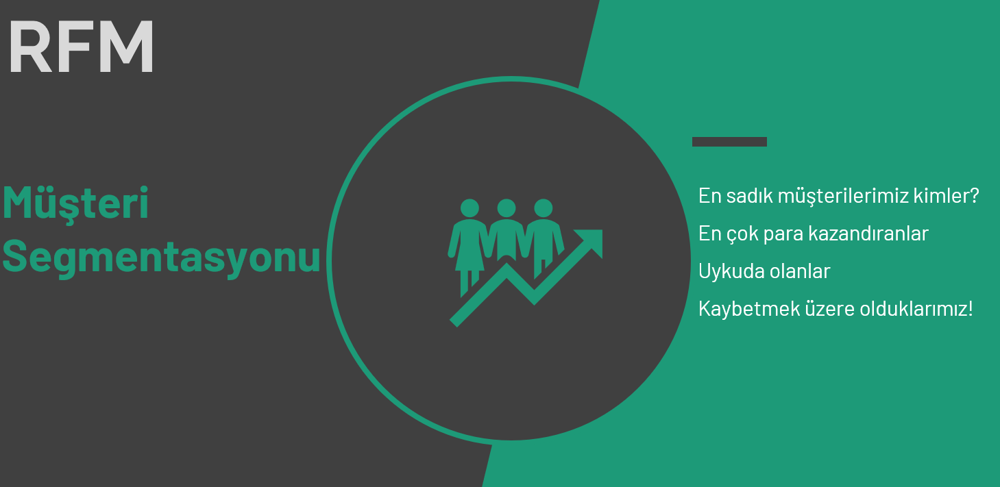

# RFM Analizi & Müşteri Segmentasyonu

<a href="https://www.oguzerdogan.com/">
    </a>





## **İş Problemi**


> **Problem:** Bir e-ticaret şirketi müşterilerini segmentlere ayırıp bu segmentlere göre pazarlama stratejileri belirlemek istiyor.

- Buna yönelik olarak müşterilerin davranışlarını tanımlayacağız ve bu davranışlarda öbeklenmelere göre gruplar oluşturacağız.
- Yani ortak davranışlar sergileyenleri aynı gruplara alacağız ve bu gruplara özel satış ve pazarlama teknikleri geliştirmeye çalışacağız.

**Veri Seti Hikayesi**

> **Veri Seti:** https://archive.ics.uci.edu/ml/datasets/Online+Retail+II

- Online Retail II isimli veri seti İngiltere merkezli online bir satış mağazasının 01/12/2009 - 09/12/2011 tarihleri arasındaki satışlarını içeriyor.
- Bu şirket hediyelik eşya satıyor. Promosyon ürünleri gibi düşünebilir.
- Müşterilerinin çoğu da toptancı.

**Değişkenler**

- InvoiceNo: Fatura numarası. Her işleme yani faturaya ait eşsiz numara. Eğer bu kod C ile başlıyorsa işlemin iptal edildiğini ifade eder.
- StockCode: Ürün kodu. Her bir ürün için eşsiz numara.
- Description: Ürün ismi
- Quantity: Ürün adedi. Faturalardaki ürünlerden kaçar tane satıldığını ifade etmektedir.
- InvoiceDate: Fatura tarihi ve zamanı.
- UnitPrice: Ürün fiyatı (Sterlin cinsinden)
- CustomerID: Eşsiz müşteri numarası
- Country: Ülke ismi. Müşterinin yaşadığı ülke.

# Dosyalar

*data/online_retail_II.xlsx* - [veriseti](https://github.com/oguzerdo/RFM_Customer_Segmentation/blob/main/data/online_retail_II.xlsx)

*RFM.ipynb* - [proje dosyası](https://github.com/oguzerdo/RFM_Customer_Segmentation/blob/main/RFM.ipynb)

rfm.pdf - [sunum dosyası](https://github.com/oguzerdo/RFM_Customer_Segmentation/blob/main/rfm.pdf)

## Kullanılan Kütüphaneler

```
pandas
numpy
seaborn
matplotlib
datetime
```

## Yazar

- Oğuz Han Erdoğan - [oguzerdo](https://github.com/oguzerdo)
